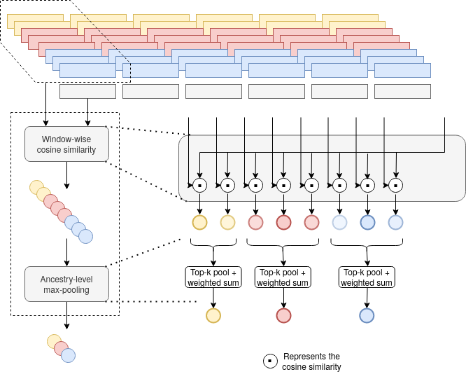

# SALAI-Net

SALAI-Net is a package for species-agnostic Local Ancestry Inference (or ancestry 
deconvolution). In other words, you can perform LAI on any species or set of 
ancestries, given a reference panel of single-ancestry individuals.



Fig. 1: Novel template matching block.


## Full paper
ECCB 2022 - Bioinformatics journal (Oxford Academics)
https://academic.oup.com/bioinformatics/article-abstract/38/Supplement_2/ii27/6701999

###Citation
```
@article{10.1093/bioinformatics/btac464,
    author = {Oriol Sabat, Benet and Mas Montserrat, Daniel and Giro-i-Nieto, Xavier and Ioannidis, Alexander G},
    title = "{SALAI-Net: species-agnostic local ancestry inference network}",
    journal = {Bioinformatics},
    volume = {38},
    number = {Supplement_2},
    pages = {ii27-ii33},
    year = {2022},
    month = {09},
    abstract = "{Local ancestry inference (LAI) is the high resolution prediction of ancestry labels along a DNA sequence. LAI is important in the study of human history and migrations, and it is beginning to play a role in precision medicine applications including ancestry-adjusted genome-wide association studies (GWASs) and polygenic risk scores (PRSs). Existing LAI models do not generalize well between species, chromosomes or even ancestry groups, requiring re-training for each different setting. Furthermore, such methods can lack interpretability, which is an important element in each of these applications.We present SALAI-Net, a portable statistical LAI method that can be applied on any set of species and ancestries (species-agnostic), requiring only haplotype data and no other biological parameters. Inspired by identity by descent methods, SALAI-Net estimates population labels for each segment of DNA by performing a reference matching approach, which leads to an interpretable and fast technique. We benchmark our models on whole-genome data of humans and we test these models’ ability to generalize to dog breeds when trained on human data. SALAI-Net outperforms previous methods in terms of balanced accuracy, while generalizing between different settings, species and datasets. Moreover, it is up to two orders of magnitude faster and uses considerably less RAM memory than competing methods.We provide an open source implementation and links to publicly available data at github.com/AI-sandbox/SALAI-Net. Data is publicly available as follows: https://www.internationalgenome.org (1000 Genomes), https://www.simonsfoundation.org/simons-genome-diversity-project (Simons Genome Diversity Project), https://www.sanger.ac.uk/resources/downloads/human/hapmap3.html (HapMap), ftp://ngs.sanger.ac.uk/production/hgdp/hgdp\_wgs.20190516 (Human Genome Diversity Project) and https://www.ncbi.nlm.nih.gov/bioproject/PRJNA448733 (Canid genomes).Supplementary data are available from Bioinformatics online.}",
    issn = {1367-4803},
    doi = {10.1093/bioinformatics/btac464},
    url = {https://doi.org/10.1093/bioinformatics/btac464},
    eprint = {https://academic.oup.com/bioinformatics/article-pdf/38/Supplement\_2/ii27/45884107/btac464.pdf},
}
```

## Installation
### Native Linux
1. Clone the repo
   ```git clone https://github.com/AI-sandbox/SALAI-Net.git```
2. Install dependencies
```pip install -r requirements```. Check [pytorch.org]() for installation of the appropiate version of pytorch and torchvision for your system.
### Docker
## Usage
### Download data and pretrained models.

Data for the main results is available in 
https://drive.google.com/file/d/1GHZvlvdAUoFDYOUfFKhTtTHCCy8INZSM/view?usp=sharing

Main model (for 1000G and dogs)
and model for the Hapmap dataset are in
https://drive.google.com/file/d/1FG67JzMq_1GhtLHnmnRxRSIy66Vhkg_K/view?usp=sharing


### Perform LAI


```python src/SALAI.py [args]```
Arguments:
- ```--model-cp```: Path to ```.pt``` checkpoint of the model's paramters
- ```--model-args```: (Optional) Path to ```.pckl``` file containing the arguments used to instanciate the model. By default take the ones in the checkpoint's parent folder.
- ```--query, -q```: Path to vcf files containing the query sequences.
- ```--reference, -r```: Path to vcf file containing the reference haplotype data.
- ```--map, -m```: Path to sample map indicating the ancestry of each reference.
- ```--out-folder, -o```: Folder where the predictions will be dumped.
- ```--batch-size, -b```: Number of references predicted at the same time, for the purpose of controlling memory consumption at inference.

usage example:

    python src/SALAI.py \
        --model-cp models/main_model/models/best_model.pth \
        -q published_data/dogs/128gen/vcf.vcf \
        -r published_data/dogs/chr30_expt1_filtered.vcf.gz \
        -m published_data/dogs/128gen/ref_panel/train2.map \
        -o prediction_folder

For whole genome data use ```main_model/models/best_model.pth``` and for shorter sequences like hapmap use ```hapmap_model/models/best_model.pth```

The code runs by default on GPU if it is available, otherwise it runs on CPU. To run on CPU when GPU is available, deactivate GPU usage by running ```export CUDA_VISIBLE_DEVICES=''``` before running SALAI

### Fine-tune SALAI-Net

## Cite


